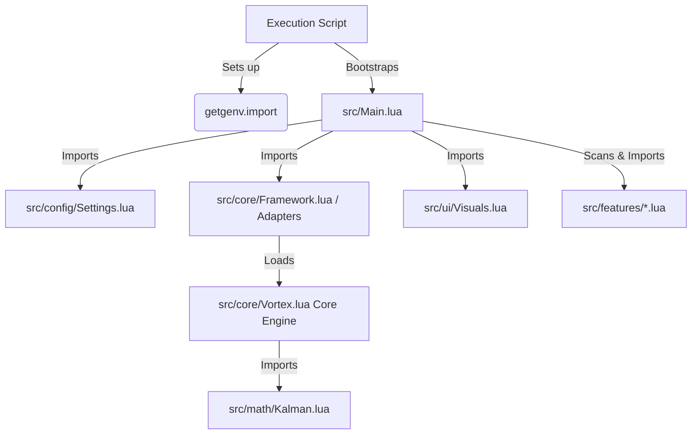

# Vortex Framework - Universal Scripting Engine

A premium, highly modularized, and clean scripting engine built on top of Roblox client environments. 

Vortex is designed to run **directly from raw modular source files** without any compilation steps. It is hosted on GitHub and connects modules dynamically using a custom `import()` function. The core has been designed to be completely universal, allowing adapters to bind game-specific logic dynamically.

---

## Unified Direct API Design

Legacy scripts had to access internal registries via `FrameWork.HL.*`. Vortex unifies the HookLoader and Framework libraries under a single interface:

* **Old**: `FrameWork.HL.Hook("@Module", "func", ...)`
* **New**: `Vortex.Hook("@Module", "func", ...)` or `Framework.Hook("@Module", "func", ...)`

---

## Folder Structure

* **src/**: Contains the modular source files.
  * **core/**
    * [Vortex.lua](file:///c:/Users/Administrator/Desktop/Roblox%20Framework/src/core/Vortex.lua): The central under-the-hood engine containing hook registries, Roblox helper methods, and `PsmSignal` architecture.
    * [Framework.lua](file:///c:/Users/Administrator/Desktop/Roblox%20Framework/src/core/Framework.lua): The Combat Warriors adapter registry layer (binds weapon data queries and equips).
    * [HookLoader.lua](file:///c:/Users/Administrator/Desktop/Roblox%20Framework/src/core/HookLoader.lua): Legacy wrapper (redirects straight to Vortex for backward compatibility).
  * **math/**
    * [Kalman.lua](file:///c:/Users/Administrator/Desktop/Roblox%20Framework/src/math/Kalman.lua): Aim prediction physics vectors.
  * **config/**
    * [Settings.lua](file:///c:/Users/Administrator/Desktop/Roblox%20Framework/src/config/Settings.lua): Default configuration flags.
  * **ui/**
    * [Visuals.lua](file:///c:/Users/Administrator/Desktop/Roblox%20Framework/src/ui/Visuals.lua): Viewport Drawing circles (FOV visualizer).
  * **features/**: Individual cheat modules:
    * [Fly.lua](file:///c:/Users/Administrator/Desktop/Roblox%20Framework/src/features/Fly.lua): Fly mechanics (reacts to `FeatureToggled` signal).
    * [Desync.lua](file:///c:/Users/Administrator/Desktop/Roblox%20Framework/src/features/Desync.lua): Replicator packet delay toggle.
    * [SilentAim.lua](file:///c:/Users/Administrator/Desktop/Roblox%20Framework/src/features/SilentAim.lua): Projectile redirection aiming.
    * [RangeExpander.lua](file:///c:/Users/Administrator/Desktop/Roblox%20Framework/src/features/RangeExpander.lua): Melee range hit expansion (uses framework `GetPartsInRange`).
    * [AntiParry.lua](file:///c:/Users/Administrator/Desktop/Roblox%20Framework/src/features/AntiParry.lua): Suppresses attacks during target parry states.
    * [AntiRagdoll.lua](file:///c:/Users/Administrator/Desktop/Roblox%20Framework/src/features/AntiRagdoll.lua): Ragdoll state override.
    * [FastSpawn.lua](file:///c:/Users/Administrator/Desktop/Roblox%20Framework/src/features/FastSpawn.lua): Character auto-spawn loop.
    * [Stamina.lua](file:///c:/Users/Administrator/Desktop/Roblox%20Framework/src/features/Stamina.lua): Stamina depletion overrides.
  * [Main.lua](file:///c:/Users/Administrator/Desktop/Roblox%20Framework/src/Main.lua): Bootstrapper and dynamic feature scanner.

* [Execution Script.lua](file:///c:/Users/Administrator/Desktop/Roblox%20Framework/Execution%20Script.lua): Main loader script to execute in your exploit console.

---

## Connection Flow & Architecture

All files load dynamically, checking for local files first and falling back to GitHub:



---

## PsmSignal Library

Vortex includes a built-in event-driven communication library based on `PsmSignal`. It is exposed globally in the environment under `PsmSignal` and `Signal`.

### Usage Example
```lua
local signal = PsmSignal.new()

-- Connect a listener
local connection = signal:Connect(function(arg1, arg2)
    print("Received:", arg1, arg2)
end)

-- Connect once-only
signal:Once(function()
    print("This fires only once!")
end)

-- Fire signal
signal:Fire("Vortex", "Engine")

-- Disconnect
connection:Disconnect()
```

---

## Live Runtime Addons (Real-Time Scripting)

Because the Vortex framework is exposed globally, standalone scripts run later can pull the core framework directly out of memory, hook game functions, and utilize reactive signals in real time.

### Real-World Example: Health State Tracker Addon

```lua
-- 1. Verify and capture the running framework from memory
if not getgenv().EXECUTED or not getgenv().import then
    warn("[Live Inject] Vortex framework must be running first!")
    return
end

local Vortex = getgenv().import("core/Vortex")
if not Vortex then
    return
end

-- 2. Define the live injection module
local CustomAddon = {}

function CustomAddon.Init(Framework)
    local LocalPlayer = game:GetService("Players").LocalPlayer

    -- Bind directly to active engine event signals for reactive execution
    LocalPlayer.CharacterAdded:Connect(function(Character)
        local Humanoid = Character:WaitForChild("Humanoid", 5)

        if Humanoid then
            Humanoid.HealthChanged:Connect(function(CurrentHealth)
                -- Trigger instant, non-throttled logic when health criteria drops
                if CurrentHealth > 0 and CurrentHealth < 16 then
                    -- Utilize HookLoader APIs directly from the active Vortex core
                    local NetworkInstance = Framework.Get("@Network")

                    if NetworkInstance then
                        print("[Live Inject] Core framework accessed at: " .. tostring(CurrentHealth) .. " HP")
                    end
                end
            end)
        end
    end)

    -- Listen to feature toggle signals from the framework
    Framework.Signals.FeatureToggled:Connect(function(featureName, state)
        print("[Live Inject] Feature status changed in real-time:", featureName, "->", state)
    end)

    print("[Live Inject] Addon successfully merged into Vortex core.")
end

-- 3. Execute immediately
pcall(CustomAddon.Init, Vortex)
```